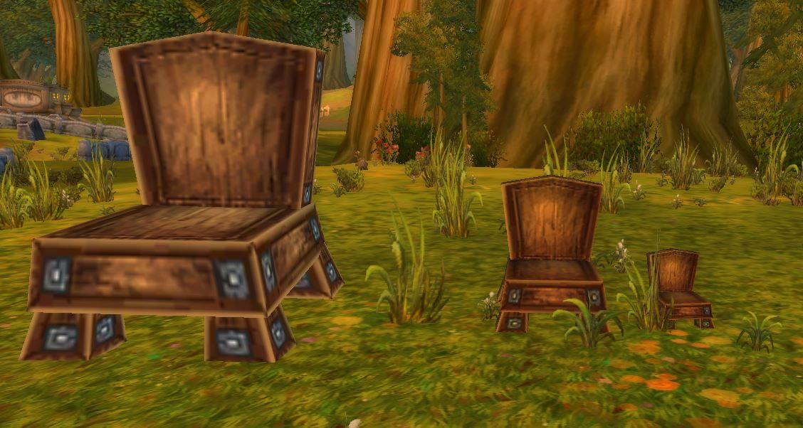

# Objscale

## Description

This module allows to set the scale/size of GameObjects and Creatures for each individual spawn. (This is a port of the [Objscale TC-Corepatch from Rochet2](https://github.com/Rochet2/TrinityCore/tree/objscale_3.3.5/src/server/scripts/Custom/objscale))





## How to use ingame

#### Creatures

Select/target a Creature and then use the following Command: 

```
npc_scale set X
```

replace X with any positive floatingpoint number

#### GameObjects

* Get the GUID of the wanted Gameobject (e.g walk up to the GameObject and use the Command .gobject near)

* use the following command to set the GameObjects scale: 

  ```
  gob_scale set Y X
  ```

  * Where Y is the GUID of the GameObject which is to be Changed. (the command also accepts the GameObject-Hyperlinks which are generated by the .gobject near command)
  * And X is the scaling factor (use any positive floatingpoint number)

  


## Requirements

the objscale Module requires:

- AzerothCore v4.0.0+
- 2 new Hooks (OnCreatureSaveToDB and OnGameObjectSaveToDB) - Will be Provided with a Pullrequest in main AC repo. Relevant git branch can be found here: https://github.com/Tralenor/azerothcore-wotlk/tree/On-Creature/GameObject-SaveToDB-Hook
  Relevant PR: https://github.com/azerothcore/azerothcore-wotlk/pull/11246


## Installation

```
1) Simply `git clone` the module under the `modules` directory of your AzerothCore source or copy paste it manually.
2) Import the SQL manually to the World Database
3) Re-run cmake and launch a clean build of AzerothCore.
```


## Credits

* [Tralenor](https://github.com/Tralenor) (author of the module)
* [Rochet2](https://github.com/Rochet2) (Original Author of Objscale)
* AzerothCore: [repository](https://github.com/azerothcore) - [website](http://azerothcore.org/) - [discord chat community](https://discord.gg/PaqQRkd)
